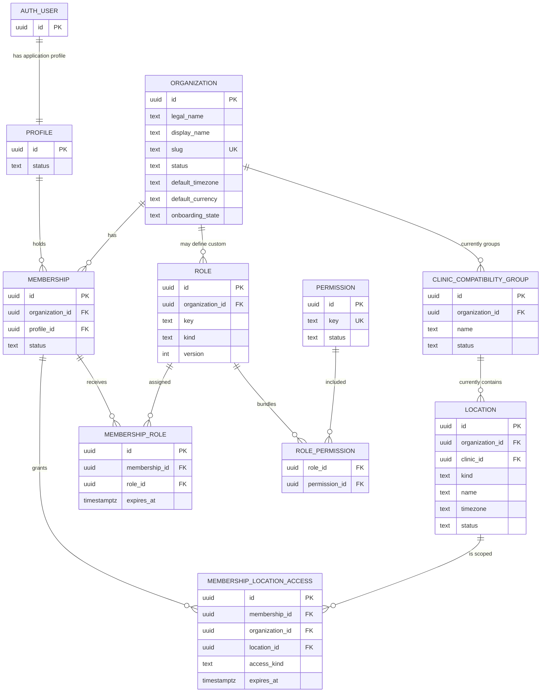
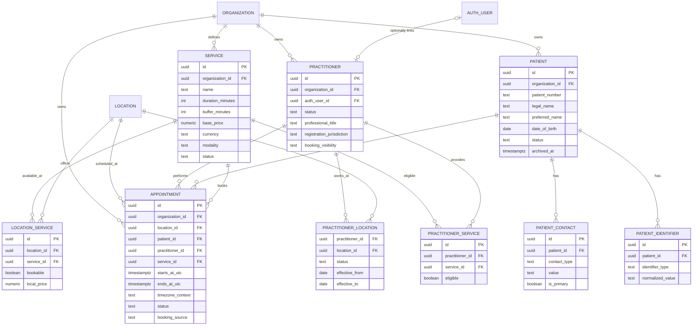

# MedBookPro Core Domain ERD

This is a conceptual ERD for Phase 2A. It intentionally includes future domain entities without creating tables or migrations. Existing identity names are shown where they are already implemented; proposed canonical names are used for future core-domain objects.

## Identity and access

## Practitioners, patients, services, and appointments

## Commercial and audit boundaries

```mermaid
erDiagram
    ORGANIZATION ||--o| SUBSCRIPTION_ACCOUNT : "commercially uses"
    SUBSCRIPTION_ACCOUNT ||--o{ SUBSCRIPTION_TRIAL : has
    SUBSCRIPTION_ACCOUNT ||--o{ ENTITLEMENT : grants
    ORGANIZATION ||--o{ INVITATION : receives
    PROFILE ||--o{ INVITATION : sends
    ORGANIZATION ||--o{ AUDIT_EVENT : scopes
    PROFILE o|--o{ AUDIT_EVENT : acts
    LOCATION o|--o{ AUDIT_EVENT : contextualizes

    SUBSCRIPTION_ACCOUNT {
        uuid id PK
        text plan_key
        text status
        text provider_customer_ref
        timestamptz grace_until
    }
    SUBSCRIPTION_TRIAL {
        uuid id PK
        uuid subscription_account_id FK
        timestamptz starts_at
        timestamptz ends_at
        text status
    }
    ENTITLEMENT {
        uuid id PK
        uuid subscription_account_id FK
        text key
        text value
        timestamptz effective_until
    }
    INVITATION {
        uuid id PK
        uuid organization_id FK
        text email_normalized
        text status
        timestamptz expires_at
    }
    AUDIT_EVENT {
        uuid id PK
        uuid organization_id FK
        uuid actor_profile_id FK
        uuid location_id FK
        text action
        text subject_type
        uuid subject_id
        timestamptz occurred_at
        jsonb safe_metadata
    }
```

### ERD rules

- `organization_id` is required directly on sensitive organization-owned entities.
- Location scope is subordinate to organization scope.
- `AUTH_USER` is the external Supabase Auth reference; it is not a tenant record.
- The existing `CLINIC_COMPATIBILITY_GROUP` is shown only to make the current schema layer explicit.
- Appointment and audit history must survive archival of related operational records.
