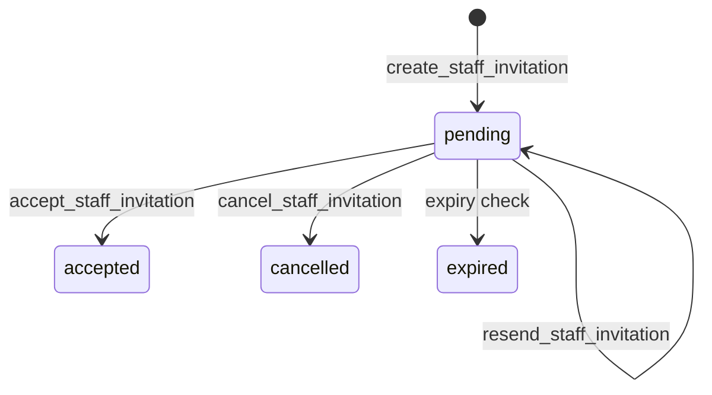
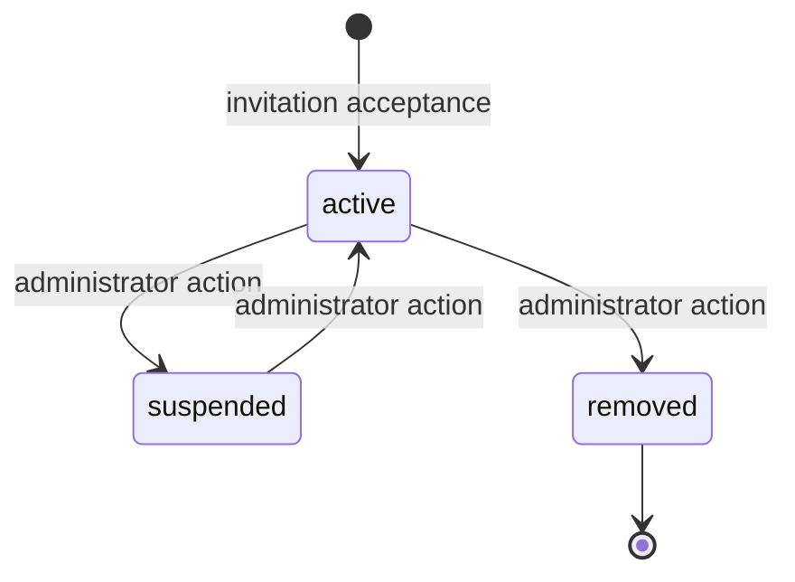

# Staff Invitations and Memberships

This document describes the Phase 2C staff-access boundary. It is limited to organization membership management; it does not create authentication flows, email delivery, or patient data.

## Lifecycle





## Database boundary

Migration `20260722100000_add_staff_membership_management.sql` reuses the existing organization, profile, role, location, invitation, membership, access-scope, and audit structures. It adds cancellation and resend metadata to invitations, removed-state history to memberships, and structured invitation role/location assignments.

Raw invitation tokens are generated only inside trusted RPC execution and stored as SHA-256 digests. They are returned only to the trusted delivery boundary. No email provider is connected in this phase.

The RPCs are `create_staff_invitation`, `resend_staff_invitation`, `cancel_staff_invitation`, `get_staff_invitation_preview`, `accept_staff_invitation`, `update_membership_roles_and_access`, and `update_membership_status`. Each validates caller, organization, role, location, invitation state, and lifecycle transition. Membership changes lock the target row and protect the last organization owner. Direct invitation writes and direct membership status changes are denied by RLS.

## Application boundary

- `/app/settings/staff` is a server-rendered staff screen.
- Server actions validate inputs with shared Zod schemas and call the RPC boundary.
- `/invitations/accept?token=...` previews only for the authenticated matching email and accepts through the database RPC.
- A development-only acceptance URL is shown locally because no delivery provider exists. Production delivery must be a trusted server-side integration and must never expose service-role credentials to browser code.

## Permissions and ownership

The existing keys `staff.read`, `staff.invite`, `staff.manage`, `staff.suspend`, and `roles.manage` are used. Only active system or organization roles are assignable; platform-super-admin is excluded. Assigning or removing `organization.owner` requires owner authority and cannot remove the final owner.

## Local validation

Run `supabase db reset --yes` before local database tests. The pgTAP suite covers anonymous denial, tenant isolation, digest storage, structured access, preview/acceptance, idempotency, cancellation, expiry, role/location checks, owner protection, lifecycle history, audit events, and direct-write denial:

```sh
supabase test db
supabase db lint
```

Tests use synthetic local identities only. Production data and hosted Supabase projects must never be used for local development.

## Open questions

- Choose the transactional email provider and delivery retry policy later.
- Decide whether invitations need configurable expiry and bulk operations.
- Add browser coverage with a deterministic local Supabase fixture once the auth harness supports the full invitation flow.
